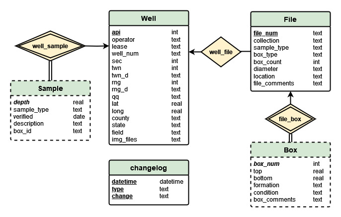

### Introduction

The purpose of this project is to turn OPIC's spreadsheet-based database into one modeled and managed by a Relational DBMS. The process involves cleaning and filtering the original file(s) then inserting data in a structured manner into a SQLite database.

### Cleaning

Unclean data is found in the 'data_intput' folder, and cleaned CSVs ready for database entry are output to 'data_output.'

Most of our data should not require cleaning, as most of our data is not frequently accessed and modified. It will require some of the steps, so it will go through the procedure but much of the procedure will not execute. However, the "Old Core" collection has  notation conventions and ad-hoc modifications that will require attention.

The cleaning procedure involves filtering out wells that have no API (these can be managed separately in a spreadsheet; they are not numerous enough to justify a new E-R database), verifying types for certain columns (i.e. latitude/longitude should be floating point values, or null, but not text), and separating lines that represent multiple boxes. These tend to represent groups of boxes that represent one formation or demarcated cores. Cleaning these instances can be demonstrated as follows:

(Box, Total, Top, Bottom) = (3, NaN, 1000, 1200)

1 row before cleaning, 3 rows after cleaning:

(Box, Total, Top, Bottom) = (1, 3, 1000, nan)
							(2, 3, nan, nan)
							(3, 3, nan, 1200)

It may also be the case that a well has entries where there is no box information at all. Some of these wells also contain known boxes, some are only entries of unknown boxes. These mystery entities are saved with alternate 'Null' box numbering (N-1, N-2, ...) and do not contribute to the total number of boxes: some of these entries represent one box, some represent many boxes. These discrepancies require in-person examination. Thus, to maintain the best record of "Total," we will include all entries but only count the known boxes. A well with only unknown box entries will therefore have a 'nan' value for 'Total.' In the cleaning procedure, these entries are separated before separating out individual boxes and then appended at the end.

### Database Building

The design of the database is shown in an E-R diagram as follows:

There is also the changelog(datetime, type, change) table, used for recording changes in primary keys in Well and File. For files in particular, we frequently reassign file numbers after wells are re-examined and restored. Thus, it will be usefull to track when we reassign file numbers.

Note that there is a weak entity relationship between Box and File; Boxes are dependent on file_num. There is also a weak entiry realtionship between Sample and Well.

It is also important to note that in the SQL file there are declarations to update foreign keys (ON UPDATE CASCADE). This ensures that we only need to update the original key in the original entity to update it everywhere, and thus multiple update statements are both unnecessary and not found in this procedure.

To execute the build, a .sql file is used to clear the .db file and set up empty tables. Then, a Python script is used to populate the .db file. Overall, the data resemble a triple-nested structure: wells contain one or more files and files contain one or more boxes. This structure is apparent in the cleaning and building code, and approximates a time complexity of O(n^3). This is not particularly efficient, but a more sophisticated and efficient method would require significant time to develop and prove at the cost of readability; the nested structure of Well -> File -> Box is intuitive.
