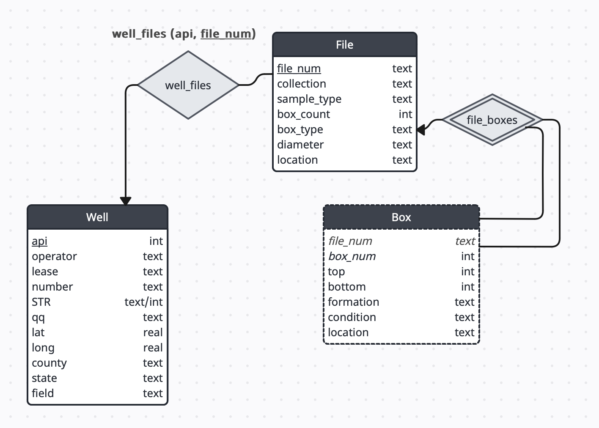

### Introduction

The purpose of this project is to turn OPIC's spreadsheet-based database into one modeled and managed by a Relational DBMS. The process involves cleaning and filtering the original file then inserting data in a structured manner into a SQLite database.

### SQLite

I have selected SQLite because it does not require a server process and so it can be hosted on our file server. It is also much lighter weight than server-client DBMS solutions such as PostgreSQL. It also offers weak/flexible typing as a feature, which is suitable for our data where there are many anomalous values in columns that *should* be a type, but contain NULL or other data.

### Cleaning

The cleaning procedure involves filtering out wells that have no API (these can be managed separately using a slightly different ER structure), verifying types for certain columns (i.e. latitude/longitude should be floating point values, or null, but not text), and separating lines that represent multiple boxes. This can be demonstrated as follows:

(Box, Total, Top, Bottom) = (1-3, 3, 1000, 1200)

After cleaning:

(Box, Total, Top, Bottom) = (1, 3, 1000, nan)
							(2, 3, nan, nan)
							(3, 3, nan, 1200)

It may also be the case that a well has entries where there is no box information at all. Some of these wells also contain known boxes, some are only entries of unknown boxes. These mystery entities are saved with alternate box numbering (N-1, N-2, ...) and do not contribute to the total number of boxes: some of these entries represent one box, some represent many boxes. Thus, to maintain the best record of "Total," we will include all entries but only count the known boxes. A well with only unknown box entries will therefore have a 'nan' value for 'Total.' In the cleaning procedure, these entries are separated before separating out individual boxes and then appended at the end.

### Database Building

The design of the database is shown in an E-R diagram as follows:

This is implemented as the following relational schema:

Well(api, ...)
File(file_num, ...)
Box(file_num, box_num)
well_file(api, file_num)

Further details can be seen in the SQL file (opic_db_schema.sql)

Note that there is a weak entity relationship between Box and File.

To build, a .sql file is used to clear the file and set up empty tables. Then, a Python script is used to populate the .db file. Overall, the data resemble a triple-nested structure: wells contain one or more files and files contain one or more boxes. This structure is apparent in the cleaning and building code.